# 🎯 Título do Quiz

Matemática e Português

---

## 📖 Introdução

Criação de um quiz proposto pelo professor Wellington para a disciplina de Programação Mobile. O trabalho consistia em escolher duas matérias escolares, 
elaborar perguntas relacionadas a elas e, posteriormente, apresentar o aplicativo aos respectivos professores para que pudessem avaliar e fornecer feedback.

---

## 👥 Integrantes do Grupo

- Isabelle Borges
- Gabrielly Souza
- Mirella Brolezi 
- Maria Eduarda Urbano 

---

## 🛠 Tecnologias Utilizadas

- MIT App Inventor  
- Arquivo .aia  
- Aplicativo .apk  

---

## 🖼 Prints das Telas

### Telas De Matemática
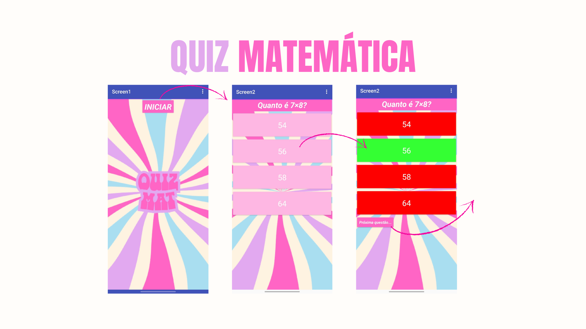
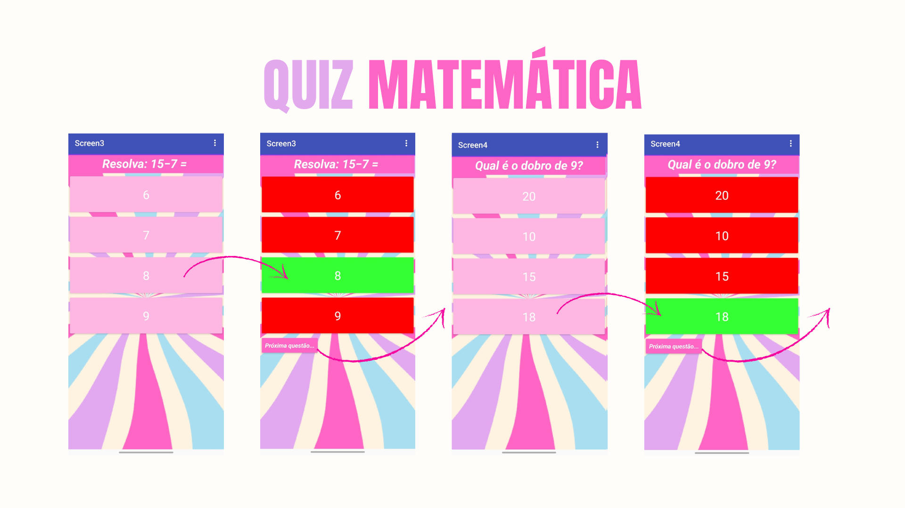
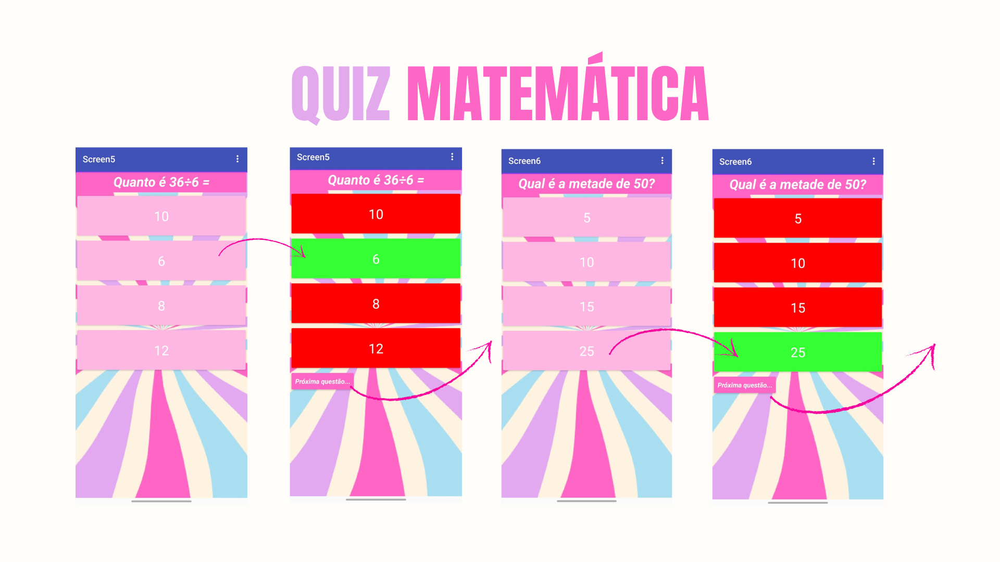
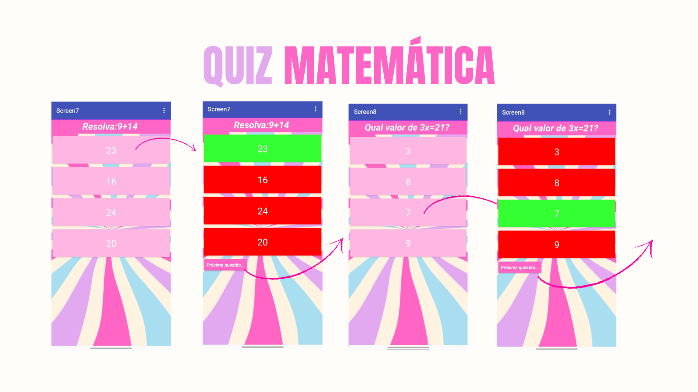
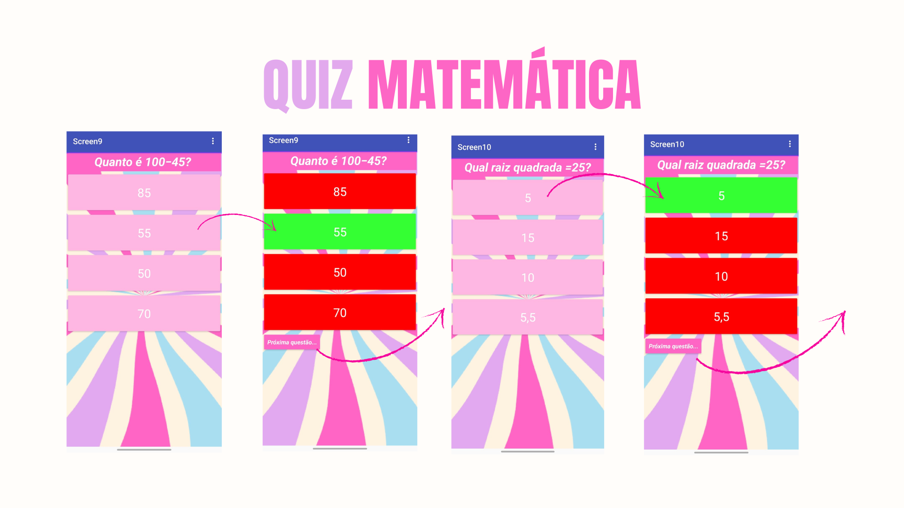
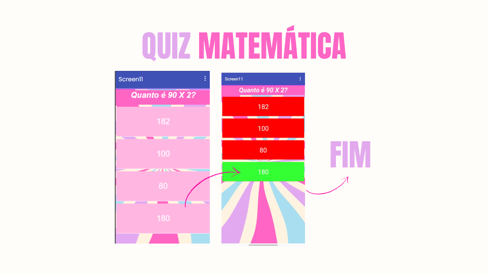

### Telas De Português
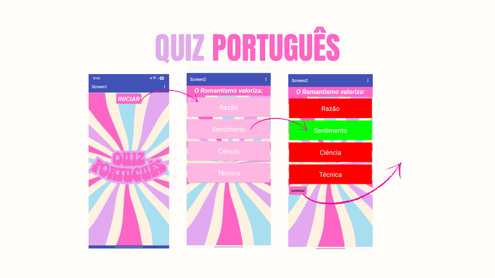
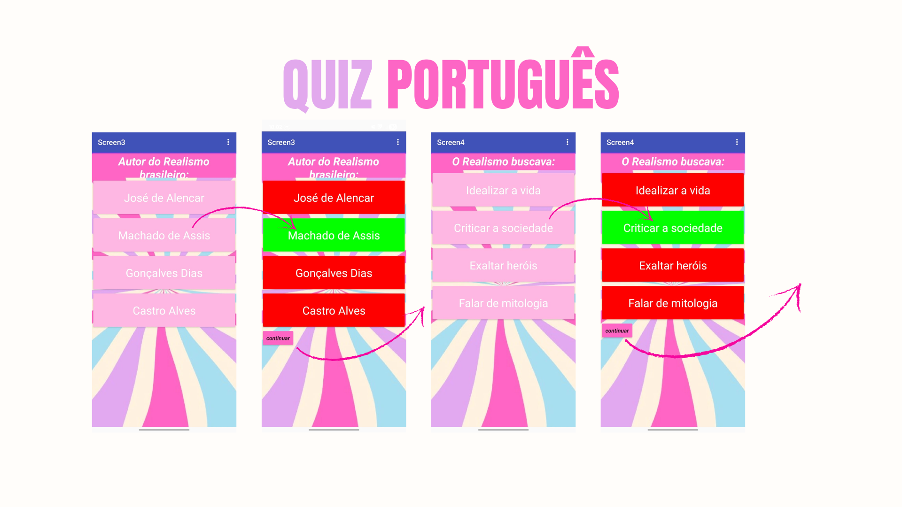
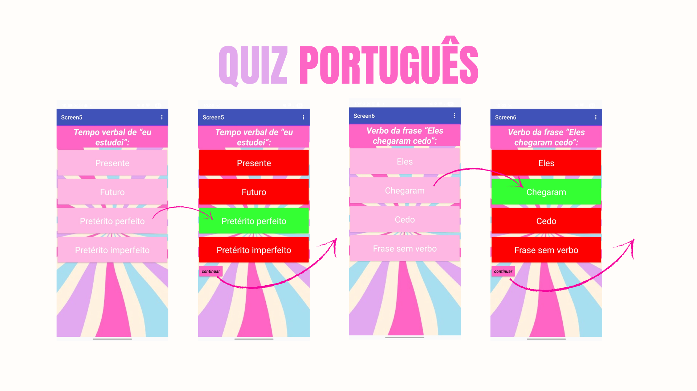
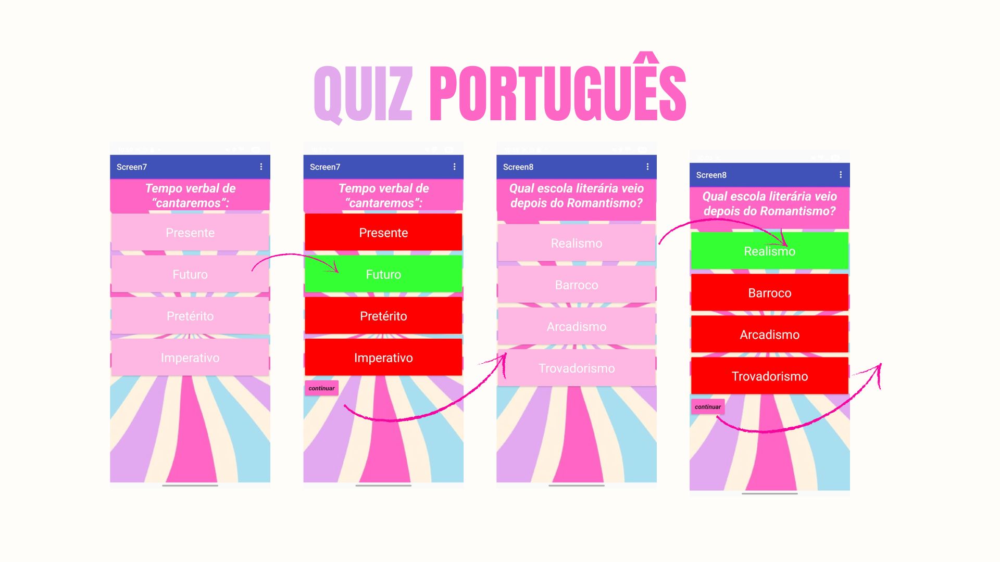
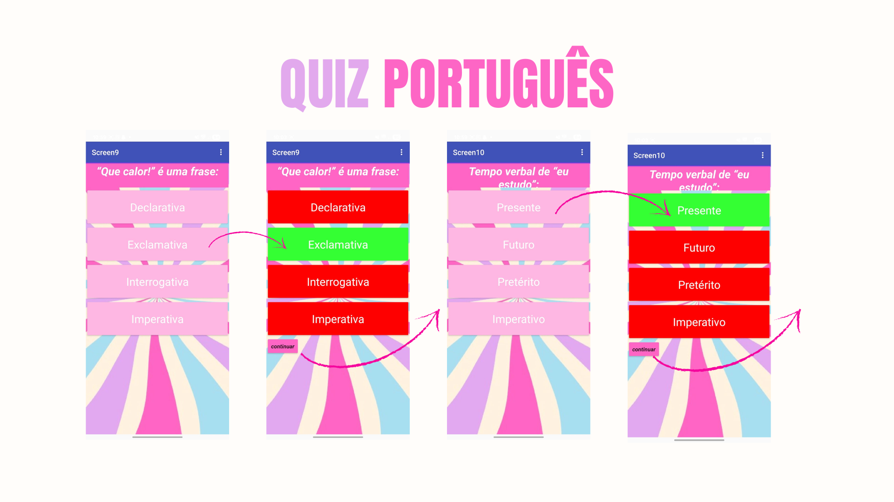
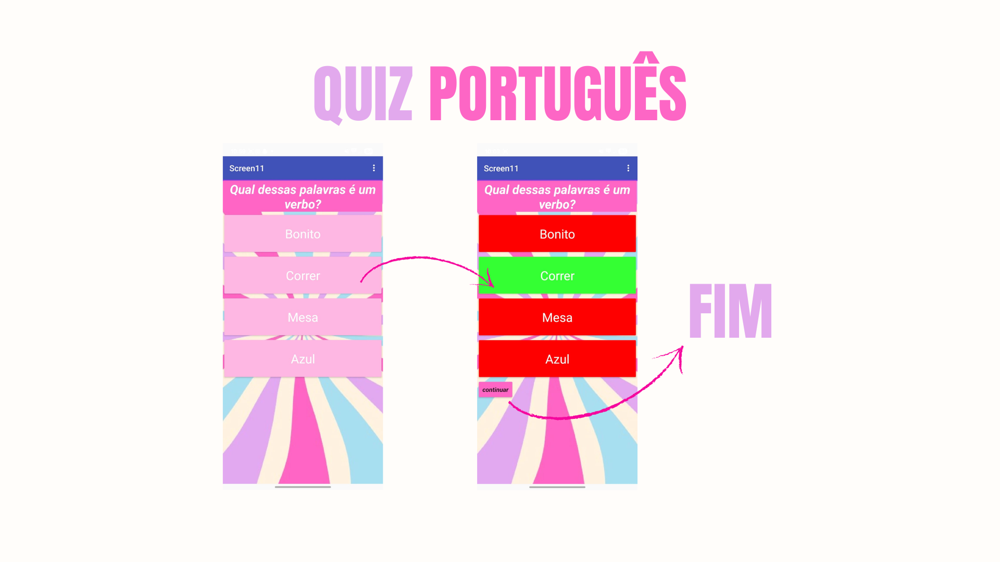

---

## 👨‍🏫 Professor Avaliador

**Nome do professor:** Wellington Fábio

---

## 📝 Comentário do Professor

**Professor de matemática:** Samantha Antonaci

Comentário sobre o quiz:

Gostou muito! Disse que é um aplicativo fácil de jogar, com a presença de cores fortes e lindas, além de um app  muito funcional!

**Professor de português:** Eliana Sambo Machado

Comentário sobre o quiz:

Primeiramente, ela adorou a ideia, disse que é super legal.
No final, ela disse que é um aplicativo super interativo, eficaz e  pedagógico
